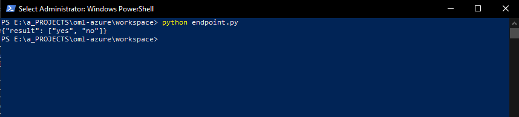
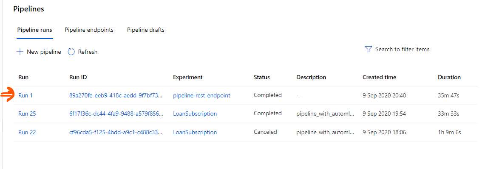
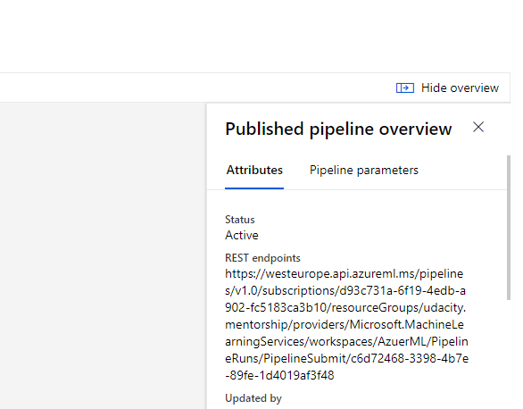

# Operationalizing Machine Learning Using Azure
It is one thing building a machine learning model, and another thing making them operational. After traning a machine learning model, it needs to be deployed into the right environment to allow access. This may be in the form of API endpoints or webservices. This project details the steps involved in deploying a model to an endpoint, which is made available as an HTTP REST API.

## Possible Future Improvements
This project's scope focused more on the machine learning process with Azure, and hence does not dwell much on optimising the model for accuracy and performance. In that regard, to improve up this model, it helps to pay more attention to the feature selection, as the prediction seems to depend on just about 8 features out of the total 20. This can seen by observing the explantion output after the model training process. When just the most important features are used,
1. The model accuracy may increase due to decreased chances of overfitting
2. The payload required for prediction will also reduce in size, and hence may increase perfomance, especially throughput and response time, of the deployed model's API.

## Architectural Diagram
Below is an architectural diagram of the project, covering the notable areas of the process:


## Key Steps
This project details the entire process from authentication to comsuming the deployed model API in 6 key steps:
1. Authentication
2. Creating The AutoML Experiment
3. Deploy the best model
4. Enable Logging
5. Documenting API With Swagger
6. Consume Model Endpoints

### Authentication
Every user of the Azure ML Studio will have to be authorized in order to use the service. To gain authorization, the user will need to be authenticated. There are several ways of authenticating with the platform, but we'll be accessing our subscription by granting permission to a [Service Principal](https://docs.microsoft.com/en-us/cli/azure/authenticate-azure-cli?view=azure-cli-latest#sign-in-with-a-service-principal) that we'll create using the Azure CLI tool ```az```. Below ar ethe steps ataken to authenticate with Azure:

- First, install the CLI tool using various ways outlined in detail, in [this documentation](https://docs.microsoft.com/en-us/cli/azure/install-azure-cli-windows?view=azure-cli-latest&tabs=azure-powershell). For this step, we use the Powershell method in windows with this shell script:
```Invoke-WebRequest -Uri https://aka.ms/installazurecliwindows -OutFile .\AzureCLI.msi; Start-Process msiexec.exe -Wait -ArgumentList '/I AzureCLI.msi /quiet'; rm .\AzureCLI.msi``` 

- After we have installed the tool, we can sign in using the following command:
```az login```. This may automatically open a browser to allow us choose which account to sign in to, or the following url will have to be opened manually in order to complete the authentication step:
[https://aka.ms/devicelogin](https://aka.ms/devicelogin)

- Upon a sucessful sign in, we would access the current sucription through a Service Principal, an account not tied to any user, and which would allow us to execute scripts securely and store credentails locally. The screenshot below shows how we scucessfully create a service principal for this session:


- Now will associate this service principal to the workspace we will be working with in our current Azure subscription:


### Creating The AutoML Experiment
After signing-in to our Azure ML Studio workspace with the service principal we created earlier on, it is time to create the AutoML experiment using the studio.

#### Uploading the dataset: 
Select the **Datasets** tab in left navigation pane of the studio workspace, then the following steps follow: 
1. **Create dataset > From web files **
2. Enter [this url](https://automlsamplenotebookdata.blob.core.windows.net/automl-sample-notebook-data/bankmarketing_train.csv), for the ```bankmarketing_train.csv``` dataset, into the **Web URL** textbox that comes with the dialog that appears.
3. Provide a name for the dataset, in this case, we used ```bankmarketing_train```, and click **Next**
4. For the **Column headers** field in the **Settings and preview** section, we select ```All files have the same headers```, then click **Next**
5. We click **Next** again till the last section, *confirm details*, then click **Create** when we have confirmed that everything looks good.

Now we should see our new dataset appear with the name we gave to it, in under the **Registered datasets** section, as shown below:


#### Creating the experiment: 
1. Select the **Automated ML(preview)** tab in the left naviagtion pane, then click on **New Automated ML Run**
2. Now, in the *select dataset* section of the *Create new Automated ML run* dialog, we select the dataset we created earlier on, then click **Next**
3. In the *Configure run* section, we enter a name to use for our expeirment, under *Create new experiment*; in this case we use ```LoanSubscription```.
4. For our *Target column*, which is the column we wish to predict, we select **y** from the dropdown list.
5. Now we need a compute resource in order to run our experiment. It is necessary to create a new one by clicking **Create new compute** below the *select compute cluster* field.
6. In the *New compute cluster* dialog, we enter a name for the compute, in this case we use ```udacity-ml```.
7. Next we select ```Standard_DS12_v2``` for the *Virtual machine size* field and enter ```1``` as the minimum number of nodes, then click **Create**
8. Back in the *Create new Automated ML run* dialog, we select **Classification**, under *Select task type*, and then click **View additional configuration settings**
9. First ensure that *Explain best model* is checked, then, in *Exit criterion*, set *training job time (hours)* to ```3```, and *Metric threshold* to ```0.056```.
10. Set *Max concurrent iterations*, under the *Concurrency* sectoin, to ```5``` and click **Save**.
11. Now click **Finish** to start the process.

When the experiment is complete, it will appear as complete, as as shown below:


And the best model shown as below:


#### Deploying The Best Model:
Now it is time to deploy the model that we have just finished training, as an API endpoint, so that it can be access through HTTP requests for prediction.

1. From the *Best model summary* section, as shown in the image above, we click the link under *Algorithm name*, to take us to the best model's home.

2. In the top menu, we click on **Deploy** to start the process by first opening dialog for deployment configuration.

3. In the name textbox we enter for this project ```predict-loan-subscription```, select ```Azure Kubernertes Service``` for the *Compute type* field, and then, we select ```udacity-atuo-ml``` as the *Compute name* for this project.
**Note: The Kubernetes compute service will have to be created from the *Compute* tab. Under *Inference clusters* an Azure Kubernertes service, which allows us to delpoy a model for real-time access.**

4. Next, we enable authentication for the endpoint, so that users will have to authenticated before using the service. This prevents illegitimate use and abuse of the service.

5. Click on the *Advanced* collapsed section, and then check *Enable Application Insights diagnostics and data collection*.

6. Click the **Deploy** button to start the deployment process.

At the end of the process, when the model has been successfylly deployed, and an endpoint created, ti will be displayed under *Real-time endpoints* section, int the **Endpoints* tab of the left navigation pane. The image below shows this result:


Clicking on the endpoint name shows the endpoint in detial, showing *Aplication Insights enabled* as *true*, as appears below:


### Enable Logging
Logging is not enabled by default in the blob-storage, hence we need to enable logging, and be able to retieve log associated with our locally. We could do this in the studio, but we'll be using the Azure CLI tool that we installed in the beginning and the Python SDK for Azure to demonstrated this possibility in code as well.

1. First, we'll create a virtual environment with python, so that our customisations are limited to our use-case(this particular environment), instead of the entire PC, as it can get increasingly overwhelming:
 
To create a virtual environment in powershell/command-prompt/bash, we type- 

```python -m venv .mvenv```

which creates a virtual invironment in a folder name *mvenv* that we have alsready created in the local workspace.

To activate the environment, we'll use:
```.mvenv\scripts\activate```

2. Now we'll go ahead and enable logging in our azure workspace. To do so, we use these lines of code:

```
import logging
import sys
from azure.storage.blob import BlobClient
from azure.identity import DefaultAzureCredential

# Set the logging level for all azure-storage-* libraries
logger = logging.getLogger('azure.storage')
logger.setLevel(logging.INFO)

# Set the logging level for all azure-* libraries
logger = logging.getLogger('azure')
logger.setLevel(logging.ERROR)

# Direct logging output to stdout. Without adding a handler,
# no logging output is captured.
handler = logging.StreamHandler(stream=sys.stdout)
logger.addHandler(handler)

# endpoint is the Blob storage URL.
endpoint = 'azuerml4140135745.blob.core.windows.net/azureml-blobstore-283c646f-cf59-416d-8fe7-d0db144034ca'
client = BlobClient(endpoint, DefaultAzureCredential(), logging_enable=True, blob_name='workspaceblobstore')

print(f"Logger enabled for INFO={logger.isEnabledFor(logging.INFO)}, " \
    f"WARNING={logger.isEnabledFor(logging.WARNING)}, " \
    f"INFO={logger.isEnabledFor(logging.INFO)}, " \
    f"DEBUG={logger.isEnabledFor(logging.DEBUG)}")

```

Now that we have enabled logging, let us run code to retrieve the logs, using the ```logs.py``` file. The image below shows the logs running after excuting the *logs.py* file:


### Documenting API With Swagger
Azure makes available a *swagger.json* for deployed models. We'll download it and setup a swagger api using a Swagger UI locally.

1. To download the *swagger.json* file, we'll head to the studio, to the endpoint we just deployed, and:  - Copy the endpoint url. 
- Next, we open a new tab in the broswer, and paste the copied url.
- Replace the part after the last ```/``` with ```swagger.json``` and press **Enter**
- Now we save the JSON displayed in the browser to the local workspace directory.

2. Next, we execute the ```swagger.sh``` shell script, which downloads and installs the swagger-ui docker image(docker will have to be installed). Note that on windows, the *.sh* file will not execute directly in command-prompt or powershell unless WSL is enabled. Another option is to convert it to a powershell script, *.ps1* file by simply copying the contents into the file saved with *.ps1* extension.
Executing the script runs the swagger ui at ```localhost:9000```

3. We now execute the ```serve.py``` to serve the swagger ui with our local *swagger.json* for the deployed model at ```localhost:8000```. Now we enter this url in the swagger interface of the swagger ui running at port 9000, to display our model API with the expected responses.

The image below shows the swagger ui displaying the HHTP API mthods and responses:


### Consuming The Model Endpoint
We've deployed the model, exposed endpoints, and it is now time to consume them.
We execute the ```endpoint.py``` file, and below are the results of a successful prediction.



## Creating And Publishing A Pipeline With Notebooks
This section highlights the steps taken to create the same project, but this time, using Jupyter Notebooks on Azure, utilising the same resources created earlier on. The results achieved is the same as that achieved with the Azure ML Studio in the earlier section.

1. in the Azure ML Studio, we upload the ```aml-pipelines-with-automated-machine-learning-step.ipynb``` filed in the local workspace, by selecting the **Notebooks** tab in the left navigation pane, and then clicking the **upload files** icon. 

2. After uploading the notebook, we now open it in **Jupiter Notebooks** by clicking the **Jupyter** dropdown and selecting **Edit in Jupyter**.

3. Now we're in Jupiter, but before carrying on with the process, we need a computer target. So we'll either create a new one or use an exsiting compute.

4. Since we need to use the already existing resources and workspace, we'll update the variables in the notebook to refelect our environment accordingly, and then we'll all the cells in the order that they appear, until all is complete.
The image below shows the *Use Run Details* widget displaying the step runs in the process and after completion:


After completion, we can also see the evidence of the process in the ML Studio.

**We can see the scheduled run scucessfylly complted as shown below:**


**Then we can see the pipeline successfully created:**


**We can also see an endpoint successfully created after completing the *Publish and run from REST endpint* section:**


**and we can particularly see it marked as active, signfying that it is live and running:**


**By clicking on the pipeline endpoint above, we displayed with the details of the pipeline showing the *Bankmarketing dataset* and the *Auto ML module* connected:**


**and the endpoint marked as active with the access url shown in the *Published endpoint overview*:**


## Screen Recording
Below is a link to the screencast of the working application, hosted on Youtube:

[https://youtu.be/237t03_O5m0](https://youtu.be/237t03_O5m0)

## Standout Suggestions

### Load-Testing The API
Below in a benchmark generated from for the API, using the Apache Benchmarking CLI tool, ```ab.exe`` :


