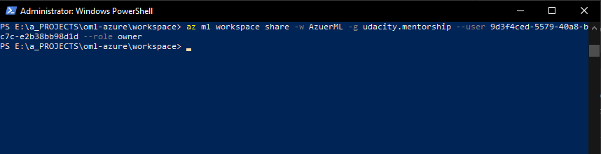

*NOTE:* This file is a template that you can use to create the README for your project. The *TODO* comments below will highlight the information you should be sure to include.


# Operationalizing Machine Learning Using Azure

*TODO:* Write an overview to your project.
It is one thing building a machine learning model, and another thing making them operational. After traning a machine learning model, it needs to be deployed into the right environment to allow access. This may be in the form of API enpoints or webservices. This project details the steps involved in deploying a model to an endpoint, and made available as an HTTP REST API.

## Architectural Diagram
*TODO*: Provide an architectual diagram of the project and give an introduction of each step.

## Key Steps
### Authentication
Every user of the Azure ML Studio will have to be authorized in order to use the service. To gain authorization, the user will need to be authenticated. There are several ways of authenticating with the platform, but we'll be accessing our subscription by granting permission to a [Service Principal](https://docs.microsoft.com/en-us/cli/azure/authenticate-azure-cli?view=azure-cli-latest#sign-in-with-a-service-principal) that we'll create using the Azure CLI tool ```az```. Below ar ethe steps ataken to authenticate with Azure:

- First, install the CLI tool using various ways outlined in detail, in [this documentation](https://docs.microsoft.com/en-us/cli/azure/install-azure-cli-windows?view=azure-cli-latest&tabs=azure-powershell). For this step, we use the Powershell method in windows with this shell script:
```Invoke-WebRequest -Uri https://aka.ms/installazurecliwindows -OutFile .\AzureCLI.msi; Start-Process msiexec.exe -Wait -ArgumentList '/I AzureCLI.msi /quiet'; rm .\AzureCLI.msi``` 

- After we have installed the tool, we can sign in using the following command:
```az login```. This may automatically open a browser to allow us choose which account to sign in to, or the following url will have to be opened manually in order to complete the authentication step:
[https://aka.ms/devicelogin](https://aka.ms/devicelogin)

- Upon a sucessful sign in, we would access the current sucription through a Service Principal, an account not tied to any user, and which would allow us to execute scripts securely and store credentails locally. The screenshot below shows how we scucessfully create a service principal for this session:


- Now will associate this service principal to the workspace we will be working with in our current Azure subscription:


*TODO* Remeber to provide screenshots of the `RunDetails` widget as well as a screenshot of the best model trained with it's parameters.

## Screen Recording
*TODO* Provide a link to a screen recording of the project in action. Remember that the screencast should demonstrate:

## Standout Suggestions
*TODO (Optional):* This is where you can provide information about any standout suggestions that you have attempted.
